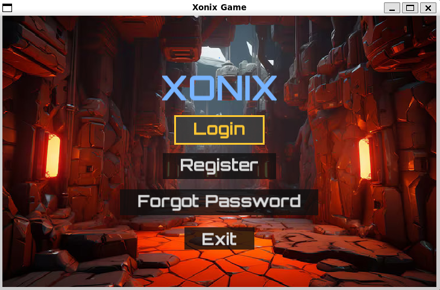
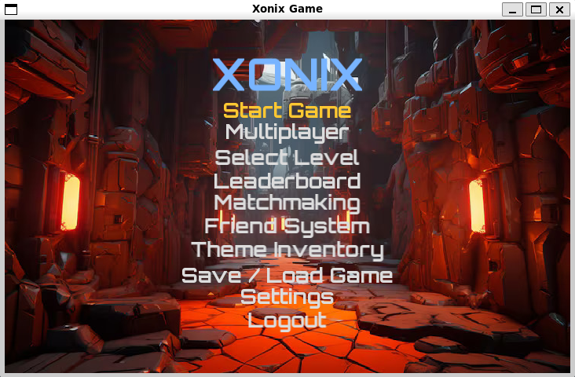
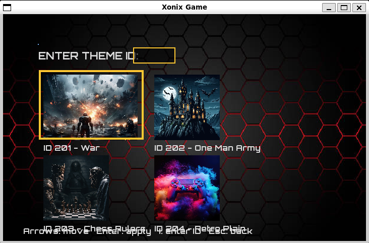
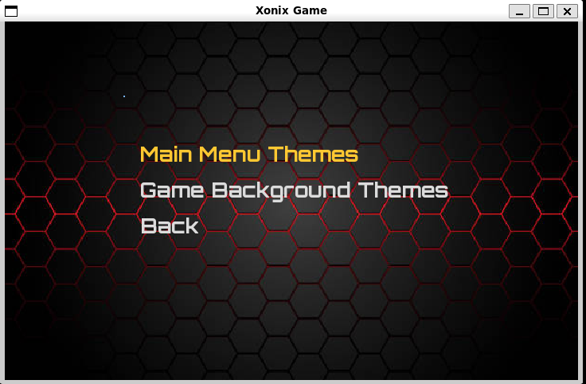
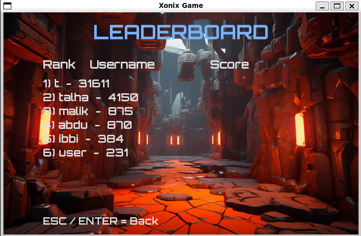

XONIX Game Using DSA 

A modern C++ and SFML based implementation of the classic Xonix with advanced gameplay features, multiplayer support, saving/loading, theme inventory, matchmaking, leaderboard, friend system and multiple DSA structures behind the game logic.

Table of Contents

~ About the Game

~ Key Features

~ How to Play

~ Screenshots

~ Technical Details

~ Data Structures Used

~ Build Instructions

~ Project Structure

~ Future Improvements

~Contributors

1. About the Game

XONIX is a fast paced territory-capturing arcade game written in C++ using SFML.
The game extends the original Xonix with multiplayer, power-ups, save/load system, theme inventory, matchmaking, and persistent player accounts.

The goal is to capture as much area as possible without being hit by enemies while expanding your territory.

2. Key Features
Gameplay

• Single Player Mode
• Multiplayer Mode (shared keyboard)
• Power-ups (speed boost, shield, freeze enemies etc)
• Enemy AI with movement logic
• Level selection and dynamic difficulty
• Match history and leaderboard tracking

Systems

• Player authentication system
• Player database (file-based)
• Matchmaking module
• Friend system using hashing
• Save and Load Game functionality
• Theme Inventory with unlockable backgrounds
• Starfield animated background
• Settings menu with sound control

UI

• Clean start menu
• Login / register system
• Theme selection grid
• Smooth navigation

3. How to Play
Controls

Player 1
W A S D to move
Space for power-up

Player 2
Arrow keys to move
Right Ctrl for power-up

Capture area by drawing lines and enclosing empty space. Avoid enemies while drawing or you lose life.

4. Screenshots

(Add your images here once you upload them)

Example:

5. Technical Details
Language

C++17

Graphics & Audio

SFML 2.5

Build

g++ with SFML libraries

6. Data Structures Used

This project includes multiple DSA applications:

Module	DSA Used	Purpose
Theme Inventory	AVL Tree	Balanced search and sorted theme retrieval
Match History	Stack	Last played match retrieval (LIFO)
Power-Ups	Stack	Push on collection / pop on use
Friend System	Hash Table	Fast lookup of friends by username
Matchmaking	Queue	FIFO matching of players
Leaderboard	Vector + Sorting	Score ranking
Save/Load System	Struct Serialization	Persistent game state
Player Database	File I/O	Storing username and credentials
7. Build Instructions
Linux

Install SFML

sudo apt install libsfml-dev

Compile

g++ main.cpp Screens.cpp Game.cpp Theme.cpp Player.cpp PlayerDatabase.cpp Starfield.cpp Enemy.cpp Leaderboard.cpp MatchMaking.cpp FriendSystem.cpp PowerUpStack.cpp MatchHistory.cpp ThemeInventory.cpp SaveGame.cpp -o xonix -lsfml-graphics -lsfml-window -lsfml-system -lsfml-audio -lsfml-network

Run

./xonix

8. Project Structure
/images           -> UI assets, themes  
/audio            -> background music and effects  
main.cpp          -> entry point  
Game.cpp          -> core gameplay  
Screens.cpp       -> UI screens  
Player.cpp        -> login/register  
PlayerDatabase.cpp-> user accounts  
PowerUpStack.cpp  -> stack-based power-ups  
ThemeInventory.cpp-> AVL theme storage  
SaveGame.cpp      -> saving & loading  
Enemy.cpp         -> enemy logic  
Leaderboard.cpp   -> scores  
MatchHistory.cpp  -> stack for match logs  
MatchMaking.cpp   -> queue system  
FriendSystem.cpp  -> hashing  

9. Future Improvements

• Online multiplayer
• Enhanced UI with animations
• Soundtrack improvements
• Achievement system
• Cloud save support

10. Contributors

• Talha Malik
Developer and designer of this project.
